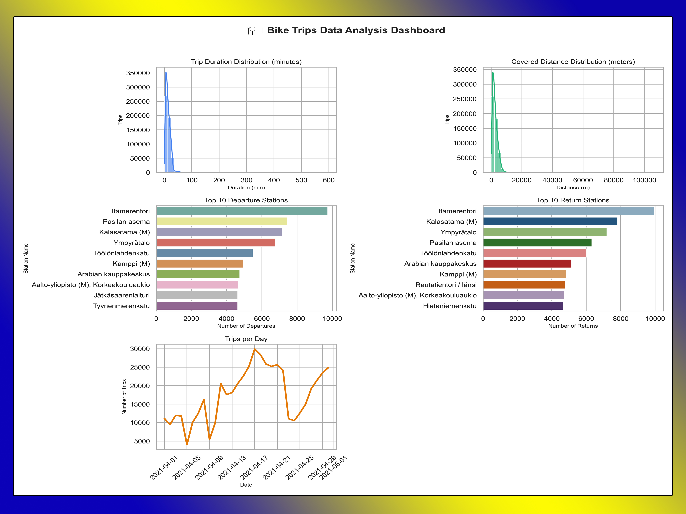

# 🚴‍♀️ Bike Trips Data Analysis Dashboard

A Python project to analyze and visualize bike trips data, generating an informative dashboard with key insights about trip duration, distance, popular stations, and daily trip counts.

---

## 📌 Features

- Clean and preprocess bike trips data
- Calculate key statistics (total trips, average duration, average distance)
- Visualize:
  - Trip duration distribution
  - Covered distance distribution
  - Top 10 departure and return stations
  - Number of trips per day
- Save dashboard as an image file

---

## 📊 Dashboard Preview

Here’s a preview of the generated dashboard:



*The dashboard includes trip duration & distance distributions, top stations, and daily trips.*

---

## 🛠️ Technologies & Libraries

- Python 3.x
- Pandas – Data manipulation
- Matplotlib – Data visualization
- Seaborn – Advanced plotting
- OS module – File handling

---

## 🚀 Getting Started

### Prerequisites

Make sure you have Python installed. Then install the required libraries:

```bash
pip install pandas matplotlib seaborn
Setup
Clone the repository:

bash
Copy code
git clone https://github.com/yourusername/bike-trips-dashboard.git
cd bike-trips-dashboard
Add your dataset file DataSet.csv to the project directory.

Running the Dashboard
bash
Copy code
python bike_dashboard.py
The script will clean and process your data.

Key statistics will be printed in the console.

A dashboard image (bike_data_dashboard.png) will be generated in the project folder.

📂 Project Structure
bash
Copy code
bike-trips-dashboard/
├── bike_dashboard.py       # Main Python script
├── DataSet.csv             # Input dataset
├── bike_data_dashboard.png # Generated dashboard
└── README.md               # Project description
🤝 Contributing
Fork the repository

Create a new branch: git checkout -b feature/new-feature

Make your changes and commit: git commit -m 'Add some feature'

Push to your branch: git push origin feature/new-feature

Open a Pull Request

📄 License
This project is licensed under the MIT License.
